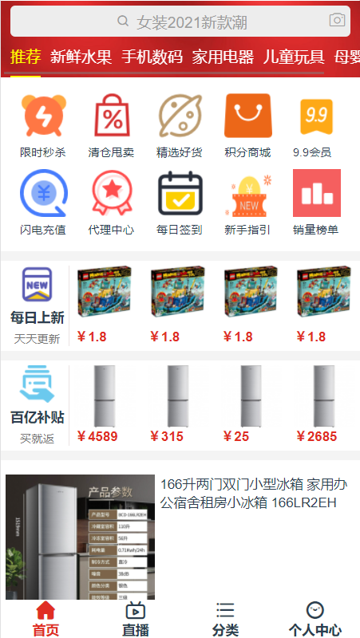
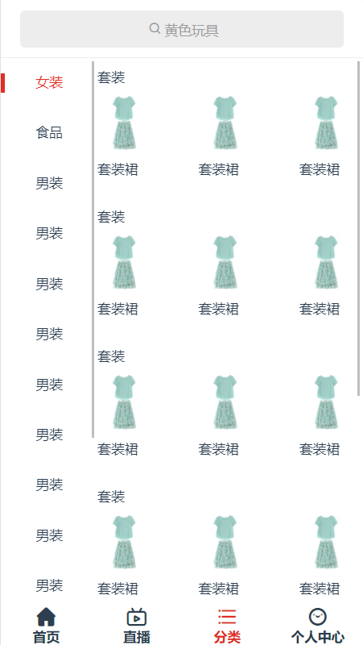
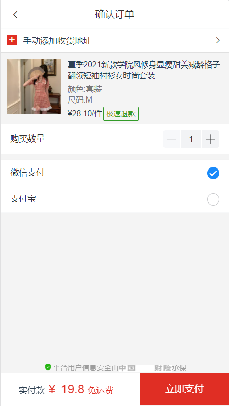
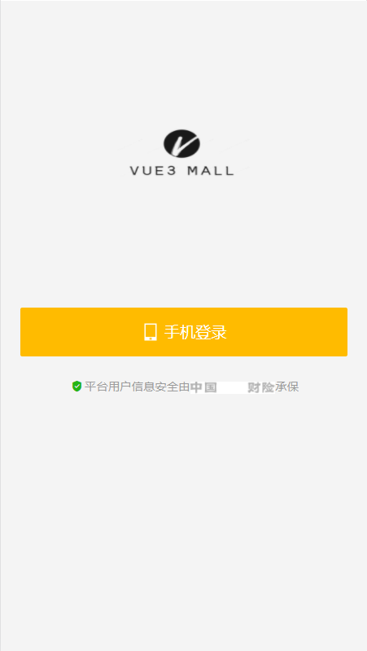
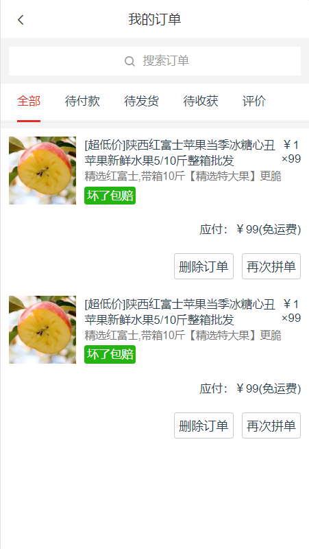
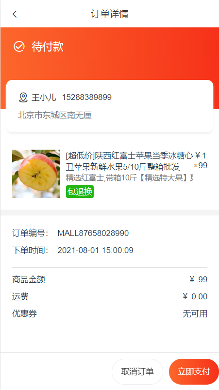
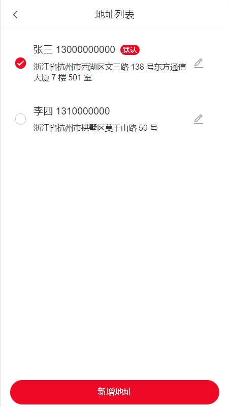
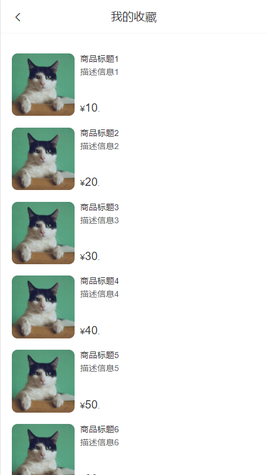

# vue3-mall
基于脚手架vue-cli3.0的商城静态页面，使用vue3的语法进行编写。
特此声明：本源码仅供学习交流使用，不得用于违法用途，如果侵犯了国家法律，责任自负。

# 商城页面展示

首页



直播


分类



个人中心


商品列表


商品详情


确认订单



登录



订单列表



订单详情



收货地址



商品收藏



设置


## Project setup
```
npm install
```

### Compiles and hot-reloads for development
```
npm run serve
```

### Compiles and minifies for production
```
npm run build
```

### Lints and fixes files
```
npm run lint
```

### Customize configuration
See [Configuration Reference](https://cli.vuejs.org/config/).
